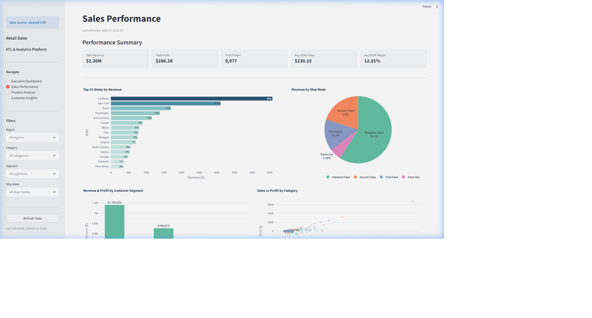
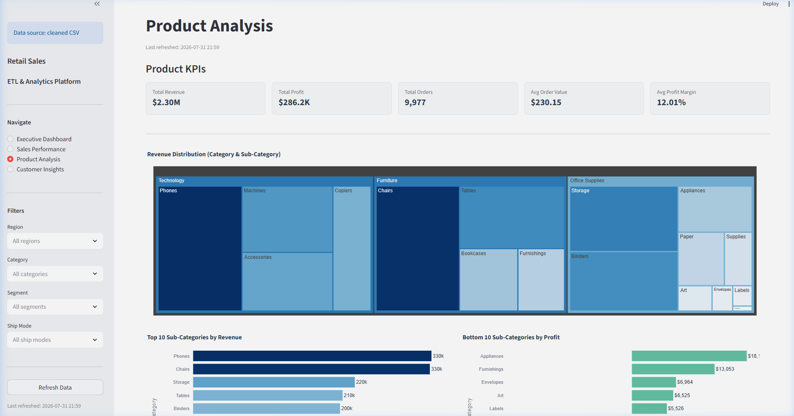
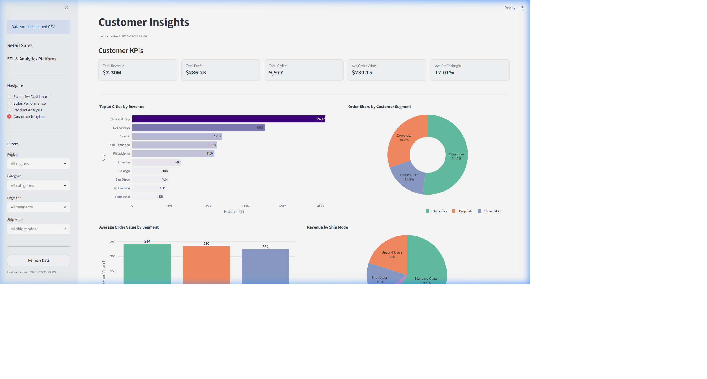

# Retail Sales ETL & Analytics Platform

> A beginner-to-intermediate level, end-to-end Data Engineering and Business Intelligence project built with Python, PostgreSQL, and Streamlit.

---

## Table of Contents

- [Project Overview](#project-overview)
- [Key Features](#key-features)
- [Technology Stack](#technology-stack)
- [Project Architecture](#project-architecture)
- [Project Structure](#project-structure)
- [Database Design](#database-design)
- [ETL Workflow](#etl-workflow)
- [Interactive Dashboard](#interactive-dashboard)
- [Dashboard Features](#dashboard-features)
- [Dashboard Screenshots](#dashboard-screenshots)
- [Installation Guide](#installation-guide)
- [Usage](#usage)
- [Future Improvements](#future-improvements)
- [Author](#author)

---

## Project Overview

### Business Problem

Retail companies generate thousands of sales transactions every day across multiple regions, product categories, and customer segments. Without a structured data pipeline and a reporting layer, it is difficult to answer questions such as:

- Which regions and products are generating the most revenue?
- Where are the losses coming from?
- How do discounts affect profitability?
- Which customer segments drive the most value?

### Project Goal

Build a complete, portfolio-quality **Retail Sales ETL & Analytics Platform** that:

1. Extracts raw sales data from a CSV source.
2. Validates and cleans the data using Python.
3. Loads it into a PostgreSQL relational database.
4. Exposes 20 SQL KPI queries for business analysis.
5. Presents an interactive Streamlit dashboard for visual exploration.

### Business Value

This platform transforms raw, unstructured sales records into actionable business insights — answering real-world questions about revenue, profit, customer behaviour, and product performance.

### Why This Project Was Built

This project was built to demonstrate practical, job-ready skills in Python data engineering, SQL analytics, and business intelligence — combining the full data lifecycle from ingestion to visualization in a single, modular, and maintainable codebase.

---

## Key Features

| Feature | Description |
|---|---|
| **End-to-End ETL Pipeline** | Automated Extract → Validate → Transform → Load workflow |
| **Data Validation** | Missing values, duplicates, invalid numerics, type checks |
| **Data Cleaning & Transformation** | Deduplication, null handling, snake_case renaming, feature engineering |
| **PostgreSQL Integration** | Cleaned data loaded into a relational database via SQLAlchemy |
| **SQL Business Analytics** | 20 KPI queries covering revenue, profit, regions, segments, and products |
| **Interactive Streamlit Dashboard** | 4-page visual analytics dashboard built with Plotly |
| **KPI Cards** | Headline metrics: Revenue, Profit, Orders, Avg Order Value, Profit Margin |
| **Modular Python Architecture** | Each phase is a separate, reusable, independently executable module |
| **Pipeline Logging** | Every run appends a structured entry to `logs/pipeline.log` |
| **Environment Variable Configuration** | Database credentials managed securely via `.env` |
| **Automatic CSV Fallback** | Dashboard works without PostgreSQL using the processed CSV |

---

## Technology Stack

| Technology | Version | Purpose |
|---|---|---|
| **Python** | 3.x | Core programming language |
| **Pandas** | Latest | Data loading, manipulation, and transformation |
| **NumPy** | Latest | Numerical operations and feature engineering |
| **PostgreSQL** | 14+ | Relational database for storing cleaned data |
| **SQLAlchemy** | Latest | Python ORM / database engine interface |
| **SQL** | Standard | 20 KPI business analysis queries |
| **Streamlit** | Latest | Interactive web dashboard framework |
| **Plotly** | Latest | Interactive chart library |
| **python-dotenv** | Latest | Secure environment variable management |
| **psycopg2-binary** | Latest | PostgreSQL adapter for Python |
| **Git** | Latest | Version control |

---

## Project Architecture

```
Raw Sales CSV (data/raw/retail_sales.csv)
        │
        ▼
┌───────────────┐
│    EXTRACT    │  scripts/extract.py
│  Load & Inspect CSV into DataFrame
└───────┬───────┘
        │
        ▼
┌───────────────┐
│   VALIDATE    │  scripts/validate.py
│  Quality checks: nulls, duplicates,
│  invalid values, types
└───────┬───────┘
        │
        ▼
┌───────────────┐
│   TRANSFORM   │  scripts/transform.py
│  Clean, rename, feature engineer,
│  save processed CSV
└───────┬───────┘
        │
        ▼
┌───────────────┐
│     LOAD      │  scripts/load.py
│  Connect to PostgreSQL via SQLAlchemy
│  Insert cleaned data into sales table
└───────┬───────┘
        │
        ▼
┌───────────────────────────┐
│   PostgreSQL Database     │  database/schema.sql
│   Table: sales (16 cols)  │
└───────────┬───────────────┘
            │
            ├──────────────────────────────────┐
            ▼                                  ▼
┌───────────────────┐              ┌──────────────────────┐
│  SQL KPI Queries  │              │  Streamlit Dashboard  │
│  database/        │              │  dashboard/app.py     │
│  queries.sql      │              │  4 interactive pages  │
│  20 KPI queries   │              │  Plotly charts        │
└───────────────────┘              └──────────────────────┘
```

**Pipeline Runner:** `scripts/run_pipeline.py` executes all four steps in sequence and logs each run to `logs/pipeline.log`.

---

## Project Structure

```
Retail-Sales-ETL-Analytics/
│
├── data/
│   ├── raw/
│   │   └── retail_sales.csv          # Original unmodified source dataset
│   └── processed/
│       └── retail_sales_cleaned.csv  # Cleaned output from transform.py
│
├── database/
│   ├── schema.sql                    # PostgreSQL table definition
│   └── queries.sql                   # 20 SQL KPI business analysis queries
│
├── scripts/
│   ├── extract.py                    # Phase 3: Load & inspect raw data
│   ├── validate.py                   # Phase 4: Data quality validation
│   ├── transform.py                  # Phase 5: Cleaning & feature engineering
│   ├── load.py                       # Phase 7: Load data into PostgreSQL
│   └── run_pipeline.py               # Phase 8: End-to-end pipeline runner
│
├── dashboard/
│   ├── app.py                        # Main Streamlit application
│   ├── database.py                   # DB connection + CSV fallback
│   ├── utils.py                      # Formatting & filtering helpers
│   ├── components.py                 # Sidebar, KPI cards, UI elements
│   └── charts.py                     # Plotly chart functions (one per chart)
│
├── images/
│   ├── dashboard_home.png            # Executive Dashboard screenshot
│   ├── sales_performance.png         # Sales Performance screenshot
│   ├── product_analysis.png          # Product Analysis screenshot
│   └── customer_insights.png         # Customer Insights screenshot
│
├── logs/
│   ├── pipeline.log                  # Appended log for every pipeline run
│   └── validation_report.txt         # Latest validation check report
│
├── .env.example                      # Template for database credentials
├── .gitignore                        # Files excluded from version control
├── LICENSE                           # MIT License
├── README.md                         # Project documentation
└── requirements.txt                  # Python dependencies
```

---

## Database Design

The PostgreSQL database contains a single table named `sales`, which stores all cleaned and transformed retail sales records.

### `sales` Table Schema

| Column | Type | Description |
|---|---|---|
| `id` | SERIAL PK | Auto-incremented surrogate primary key |
| `ship_mode` | VARCHAR(50) | Shipping method (Standard Class, First Class, etc.) |
| `segment` | VARCHAR(50) | Customer segment (Consumer, Corporate, Home Office) |
| `country` | VARCHAR(100) | Country of the order |
| `city` | VARCHAR(100) | City of the order |
| `state` | VARCHAR(100) | State of the order |
| `postal_code` | INTEGER | Postal/ZIP code |
| `region` | VARCHAR(50) | Sales region (East, West, Central, South) |
| `category` | VARCHAR(100) | Product category (Furniture, Office Supplies, Technology) |
| `sub_category` | VARCHAR(100) | Product sub-category |
| `sales` | NUMERIC(12,4) | Raw sale amount |
| `quantity` | INTEGER | Number of units sold |
| `discount` | NUMERIC(6,4) | Discount fraction applied (0.0 – 1.0) |
| `profit` | NUMERIC(12,4) | Profit or loss on the transaction |
| `revenue` | NUMERIC(12,4) | Alias for sales (explicit for reporting clarity) |
| `profit_margin` | NUMERIC(10,2) | (profit / sales) × 100, rounded to 2 decimals |

> **Note:** `profit_margin` rows where sales = 0 are safely set to 0.0 to avoid division-by-zero errors.

---

## ETL Workflow

### Step 1 — Extract (`scripts/extract.py`)

Reads `data/raw/retail_sales.csv` into a pandas DataFrame. Verifies the file exists, prints a structured dataset summary (shape, column names, data types, missing values, first five rows), and returns the DataFrame.

### Step 2 — Validate (`scripts/validate.py`)

Runs a set of data quality checks on the raw DataFrame:
- **Missing values** — counts NaN cells per column
- **Duplicate rows** — identifies fully identical records
- **Invalid numeric values** — flags negative Sales, zero-or-negative Quantity, negative Discount, and loss-making Profit rows
- **Empty text values** — checks Segment, Country, Region, and Category columns
- **Data type verification** — confirms key columns carry the expected dtype

Saves the full report to `logs/validation_report.txt`.

### Step 3 — Transform (`scripts/transform.py`)

Cleans and enriches the raw DataFrame in six sequential steps:
1. **Remove duplicates** — 17 fully identical rows removed
2. **Handle missing values** — fills NaN with sensible defaults (0.0 for numerics, "Unknown" for text)
3. **Convert date columns** — coerces date strings to `datetime64` (skipped if no date columns present)
4. **Standardize text** — strips whitespace, applies Title Case
5. **Rename to snake_case** — e.g. `Ship Mode` → `ship_mode`
6. **Create features** — adds `revenue`, `profit_margin`, and optionally `year`, `month`, `quarter`

Saves the cleaned output to `data/processed/retail_sales_cleaned.csv`.

### Step 4 — Load (`scripts/load.py`)

Reads credentials from `.env`, connects to PostgreSQL via SQLAlchemy, reads the cleaned CSV, and inserts all rows into the `sales` table using `pandas.to_sql()` with `if_exists='replace'`. Verifies the row count with `SELECT COUNT(*) FROM sales`.

### Step 5 — Pipeline Runner (`scripts/run_pipeline.py`)

Runs all four steps in sequence. Displays per-step progress and timing. If any step fails, the pipeline stops immediately, logs the failure, and exits with a non-zero code. Every run appends a structured entry to `logs/pipeline.log`.

### Logging

`logs/pipeline.log` captures start time, end time, per-step status, total execution time, rows loaded, and any error messages. The file is never overwritten — each run appends a new entry.

---

## Interactive Dashboard

The dashboard is built with Streamlit and Plotly, and connects to PostgreSQL by default. If PostgreSQL is unavailable or not configured, it automatically falls back to the cleaned CSV.

### Page 1 — Executive Dashboard

> *"What are the headline numbers?"*

- **5 KPI cards:** Total Revenue, Total Profit, Total Orders, Avg Order Value, Avg Profit Margin
- **Revenue by Region** — horizontal bar chart comparing East, West, Central, South
- **Revenue by Category** — donut chart: Furniture, Office Supplies, Technology
- **Revenue & Profit by Segment** — grouped bar: Consumer, Corporate, Home Office
- **Top 10 Sub-Categories** — ranked by total revenue

### Page 2 — Sales Performance

> *"Where are we selling the most and where are margins being eroded?"*

- **Top 15 States by Revenue** — geographic performance ranking
- **Revenue by Ship Mode** — pie chart: logistics breakdown
- **Sales vs Profit Scatter** — category-coloured, hover tooltips
- **Discount vs Profit Margin** — OLS trendline showing discount erosion
- **Sortable data table** — full filtered dataset

### Page 3 — Product Analysis

> *"Which products should we focus on and which ones are losing money?"*

- **Revenue Treemap** — hierarchical: Category → Sub-Category
- **Top 10 Sub-Categories by Revenue** — best sellers
- **Bottom 10 Sub-Categories by Profit** — loss makers (red bars)
- **Profit by Category** — which category earns the most
- **Avg Profit Margin by Category** — red-yellow-green colour scale
- **Avg Discount by Category** — where discounts are highest

### Page 4 — Customer Insights

> *"Who are the most valuable customers and which segment should we focus on?"*

- **Top 10 Cities by Revenue** — geographic concentration
- **Order Share by Segment** — donut chart
- **Avg Order Value by Segment** — which segment spends more per order
- **Revenue by Ship Mode** — logistics contribution
- **Revenue & Profit by Segment** — full side-by-side comparison

---

## Dashboard Features

| Feature | Details |
|---|---|
| **Interactive Filters** | Region, Category, Segment, Ship Mode — all charts update instantly |
| **KPI Cards** | 5 headline metrics on every page |
| **Refresh Data Button** | Clears the cache and re-queries PostgreSQL (or CSV) |
| **Real-Time DB Connection** | Connects to PostgreSQL when `.env` is configured |
| **Automatic CSV Fallback** | Uses `data/processed/retail_sales_cleaned.csv` if DB is unavailable |
| **Responsive Layout** | Streamlit wide layout with two-column chart grids |
| **Caching** | `@st.cache_resource` for the DB engine, `@st.cache_data(ttl=300)` for query results |
| **Expandable Tables** | Raw data preview and summary tables inside `st.expander` |
| **Hover Tooltips** | Every Plotly chart includes rich hover information |

---

## Dashboard Screenshots

### Executive Dashboard


### Sales Performance


### Product Analysis


### Customer Insights


---

## Installation Guide

### Prerequisites

- Python 3.8 or higher
- PostgreSQL 14 or higher (optional — dashboard works without it via CSV fallback)
- Git

---

### 1. Clone the Repository

```bash
git clone https://github.com/your-username/Retail-Sales-ETL-Analytics.git
cd Retail-Sales-ETL-Analytics
```

### 2. Create a Virtual Environment

```bash
# Windows
python -m venv venv
venv\Scripts\activate

# macOS / Linux
python -m venv venv
source venv/bin/activate
```

### 3. Install Dependencies

```bash
pip install -r requirements.txt
```

### 4. Configure Environment Variables

```bash
# Copy the example file
copy .env.example .env      # Windows
cp .env.example .env        # macOS / Linux
```

Open `.env` and fill in your PostgreSQL credentials:

```env
DB_HOST=localhost
DB_PORT=5432
DB_NAME=retail_sales_db
DB_USER=postgres
DB_PASSWORD=your_password
```

> **Skip this step** if you do not have PostgreSQL installed. The dashboard will automatically use the cleaned CSV instead.

### 5. Create the PostgreSQL Database

```sql
-- Run this in psql or pgAdmin
CREATE DATABASE retail_sales_db;
```

### 6. Execute the SQL Schema (Optional)

```bash
psql -U postgres -d retail_sales_db -f database/schema.sql
```

> This step is optional. `scripts/load.py` creates the table automatically.

### 7. Run the ETL Pipeline

```bash
# Run the full pipeline in one command
python scripts/run_pipeline.py
```

Or run individual steps:

```bash
python scripts/extract.py
python scripts/validate.py
python scripts/transform.py
python scripts/load.py
```

### 8. Launch the Streamlit Dashboard

```bash
python -m streamlit run dashboard/app.py
```

The dashboard opens at **retail-sales-data-platform.streamlit.app**

---

## Usage

### Individual ETL Modules

| Command | Description |
|---|---|
| `python scripts/extract.py` | Load raw CSV and print dataset summary |
| `python scripts/validate.py` | Run data quality checks, save validation report |
| `python scripts/transform.py` | Clean data and save processed CSV |
| `python scripts/load.py` | Load cleaned data into PostgreSQL |
| `python scripts/run_pipeline.py` | Run the full ETL pipeline end-to-end |

### Dashboard

```bash
python -m streamlit run dashboard/app.py
```

- If `.env` is configured and PostgreSQL is running → connects to the database
- If PostgreSQL is unavailable → automatically falls back to `data/processed/retail_sales_cleaned.csv`

### SQL Analysis

```bash
# Run all KPI queries in psql
psql -U postgres -d retail_sales_db -f database/queries.sql
```

Or open individual queries in pgAdmin to run them one by one.

### Refreshing Dashboard Data

1. Run `python scripts/run_pipeline.py` to refresh the database
2. Click **Refresh Data** in the dashboard sidebar
3. All charts update with the latest data

---

## Future Improvements

| Improvement | Description |
|---|---|
| **Docker** | Containerise the pipeline and dashboard for portable deployment |
| **Scheduled ETL** | Automate pipeline runs using Apache Airflow or cron |
| **CI/CD** | Add GitHub Actions to run validation checks on every push |
| **Cloud Deployment** | Deploy dashboard to Streamlit Cloud, AWS, or Azure |
| **REST API** | Expose KPI endpoints using FastAPI |
| **Data Warehouse** | Migrate from PostgreSQL to a cloud warehouse (BigQuery, Snowflake) |
| **Authentication** | Add user login to the dashboard |
| **Role-Based Access** | Different views for managers vs analysts |
| **Historical Tracking** | Slowly Changing Dimensions for trend analysis over time |

---

## Author

**Mahima Yadav**

- GitHub: [github.com/mahimayadav04](https://github.com/mahimayadav04)
- LinkedIn: [linkedin.com/in/mahimayadav01](https://www.linkedin.com/in/mahimayadav01/)

---

> Built as a portfolio project to demonstrate practical Python data engineering, SQL analytics, and business intelligence skills.
